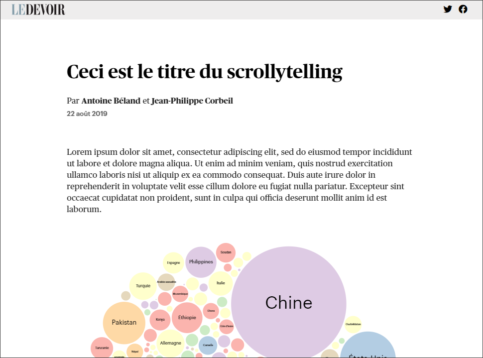

# Gabarit pour _scrollytelling_

Cet entrepôt contient le gabarit de base à utiliser pour réaliser un _scrollytelling_ sur le site web du _Devoir_. Le
gabarit est basé sur [webpack](https://webpack.js.org/) et permet d'automatiser certaines étapes pour le
développement et le déploiement d'un _scrollytelling_ respectant les contraintes du journal.

Pour consulter un exemple d'article utilisant ce gabarit, référez-vous à la branche
[example](https://github.com/LeDevoir/scrollytelling_template/tree/example).



## Prérequis
Avant de pouvoir être en mesure d'exécuter le projet, vous devez installer [Node.js](https://nodejs.org/en/).

## Démarrage du serveur
Une fois que Node.js est installé sur votre ordinateur, vous devez suivre les instructions suivantes pour être
en mesure d'utiliser le gabarit sur votre machine.

La première étape consiste à installer les dépendances nécessaires au gabarit. Pour ce faire, vous devez taper la
commande suivante dans un terminal à la racine du projet:

```
npm install
```

La deuxième étape consiste à démarrer le serveur. Encore une fois, vous devez taper la commande suivante dans un terminal:

```
npm start
```

Une fois le serveur démarré, l'application est accessible au `http://localhost:8080/`. Il est à noter que la page web
est automatiquement rechargée lorsque des modifications sont apportées aux fichiers se trouvant dans le dossier `src`.

## Configuration du gabarit
Le gabarit est facilement configurable via le fichier de configuration qui se trouve dans le dossier `src`.
L'utilisation d'un fichier de configuration permet d'éviter de dupliquer des informations dans le gabarit HTML, ce qui
permet également de réduire le risque d'erreurs ou d'oublies. Ce fichier est nommé `config.json`.

Ce fichier définit plusieurs variables qui doivent être **obligatoirement** reconfigurées à chaque fois qu'un nouvel
article utilisant le gabarit est publié. Les variables qui doivent être configurées sont illustrées ci-dessous:

* **title**: le titre de l'article.
* **authors**: la liste des auteurs de l'article. Chacun des auteurs doit être défini en utilisant les deux variables
suivantes:
  * **name**: le nom de l'auteur.
  * **url**: l'URL vers le profil de l'auteur sur le site web du _Devoir_.
  * **role**: la contribution de l'auteur à l'article (p. ex. «Design et développement», «Texte et photos», etc.).
* **date**: la date de publication de l'article.
* **update**: la date de mise à jour de l'article. Si l'article n'est pas mis à jour, la valeur doit être une chaîne vide.
* **url**: l'URL où l'article sera publié sur le site web du _Devoir_.
* **description**: la description de l'article qui sera utilisée pour le partage sur les médias sociaux.
* **image**: l'URL vers l'image qui doit être utilisée pour le partage sur les médias sociaux.

Une fois que le fichier `config.json` est mis à jour, assurez-vous de redémarrer le serveur en l'arrêtant puis en tapant
la commande `npm start`. Cette étape est nécessaire afin que les informations à afficher sur la page web soient bel et
bien mises à jour.

## Structure du gabarit
Les fichiers nécessaires pour le bon fonctionnement du gabarit se trouvent dans le dossier `src`. Le dossier `src` est
structuré de la manière suivante:

* `app`: dossier contenant les fichiers JavaScript nécessaires au fonctionnement du _scrollytelling_.
  * `app.js`: fichier permettant d'inclure les visualisations utilisées et d'initialiser le scroller.
  * `scroller.js`: fichier définissant le scroller (**ne pas modifier**)
* `assets`: dossier contenant les ressources nécessaires à la page web.
  * `fonts`: dossier contenant les polices utilisées par _Le Devoir_ (**ne pas modifier**).
  * `img`: dossier contenant les images utilisées dans le fichier `index.html`.
  * `lib`: dossier contenant les bibliothèques JavaScript utilisées n'étant pas disponibles sur
  [npm](https://www.npmjs.com/) (**ne pas modifier**).
  * `styles`: dossier contenant les fichiers de style utilisés par le gabarit. Ces fichiers sont au format
  [SCSS](https://sass-lang.com/).
  * `videos`: dossier contenant les fichiers vidéos utilisés par le gabarit.
  * `webfonts`: dossier contenant les polices utilisées par [Font Awesome](https://fontawesome.com/) (**ne pas
  modifier**).
* `data`: dossier contenant les données utilisées par les visualisations.
* `config.json`: fichier de configuration du gabarit (voir section précédente).
* `index.html`: gabarit HTML de l'article.

## Utilisation du gabarit
Avant d'utiliser le gabarit, assurez-vous de l'avoir configuré et d'avoir démarré le serveur
(voir sections précédentes). Les sous-sections qui suivent décrivent les étapes nécessaires pour la création
de différents types de section dans le gabarit HTML (`src/index.html`). Il est à noter que les sections suivantes
doivent être définies entre la balise `<main>` du fichier `index.html`.

### Section d'introduction (`intro-section`)
Une section d'introduction permet d'afficher le titre de l'article, les auteurs, la date de publication et le texte
à utiliser comme amorce. Il est à noter que **vous ne devez pas modifier** le titre de l'article, les auteurs et la
date de publication directement dans le fichier HTML puisque ces informations sont automatiquement intégrées à la page
à partir des informations définies dans le fichier `config.json`. Vous devez donc uniquement modifier le texte de
l'amorce.

Le code HTML nécessaire pour définir une section d'introduction est illustré ci-dessous.
```html
<section class="intro-section">
  <h1>Le titre de l'article</h1>
  <address>
    <div class="authors">
      Par <a href="#">Antoine Béland</a> et <a href="#">Jean-Philippe Corbeil</a>
    </div>
    <div class="date">22 août 2019</div>
  </address>
  <p>
    Le texte de l'amorce... (À MODIFIER ICI)
  </p>
</section>
```

### Section de visualisation (`viz-section`)
Une section de visualisation permet d'afficher une visualisation qui peut être modifiée en fonction de
l'élément affiché à l'écran. En d'autres mots, la visualisation peut être mise à jour en fonction de la
position du curseur de défilement. Il est à noter qu'il peut y avoir plusieurs sections de visualisation
dans un même article.

Pour définir une section qui va lancer un évènement une fois visible à l'écran, vous devez ajouter un
élément `<section>` dans l'élément `<div class="steps">`.

En ce qui concerne le code JavaScript nécessaire pour le fonctionnement d'une section de visualisation, vous devez
spécifier une liste de fonctions (aussi appelé _callbacks_) à la fonction `scroller` appelée dans le fichier `app.js`.
Cette liste doit être de la même taille que le nombre de sections définit dans l'élément `<div class="steps">`.
Autrement dit, une fonction doit être associée à chacun des éléments `<section>` définit dans l'élément
`<div class="steps">`. Ainsi, la bonne fonction sera appelée une fois qu'une section particulière deviendra visible.

Le code HTML ci-dessous illustre un exemple possible pour une section de visualisation.
```html
<section class="viz-section">
  <div class="steps">
    <section>
      <h1>Titre de la section 1</h1>
      <p>Description de la section 1...</p>
    </section>
    <section>
      <p>Description de la section 2...</p>
    </section>
    <section>
      <p>Description de la section 3...</p>
    </section>
    <section>
      <h1>Titre de la section 4</h1>
      <p>Description de la section 4...</p>
    </section>
  </div>
  <div class="viz" id="viz-1"></div>
</section>
```

Le code JavaScript correspondant au code HTML en exemple est illustré ci-dessous. Dans ce cas, la fonction correspondant
à une section particulière est appelée lorsque cette même section devient visible à l'écran. Les fonctions peuvent donc
être utilisées pour mettre à jour la visualisation affichée.
```js
// fichier "app.js"
import '../assets/styles/style.scss';
import { scroller } from "./scroller";

scroller([[
    () => console.log('Appelé lorsque la section 1 est visible.'),
    () => console.log('Appelé lorsque la section 2 est visible.'),
    () => console.log('Appelé lorsque la section 3 est visible.'),
    () => console.log('Appelé lorsque la section 4 est visible.')
  ]]).initialize();
```

Dans l'optique de conserver un code propre et maintenable, il est fortement recommandé de **créer un nouveau fichier
JavaScript pour chacune des sections de visualisation dans l'article**. Ainsi, la logique nécessaire pour la création
de la première visualisation pourrait être contenue dans le fichier `viz.js`. Ce fichier pourrait alors uniquement
exporter les fonctions appelées lorsqu'une section spécifique devient visible à l'écran.

Par souci de clarté, voici à quoi pourrait ressemble le fichier `viz.js`.

```js
// fichier "viz.js"

import * as d3 from "d3";

const width = 1000;
const height = 700;

const visContainer = d3.select('#viz1');
const g = visContainer.append('svg')
  .attr('viewBox', `0 0 ${width} ${height}`)
  .attr('preserveAspectRatio', 'xMidYMid');

export async function initialize() {
  const data = await d3.csv('./data/data.csv');

  // Logique pour l'initialisation de la visualisation...

  return [
    () => console.log('Appelé lorsque la section 1 est visible.'),
    () => console.log('Appelé lorsque la section 2 est visible.'),
    () => console.log('Appelé lorsque la section 3 est visible.'),
    () => console.log('Appelé lorsque la section 4 est visible.')
  ]
}
```

Dans ce cas, le fichier `app.js` pourrait être simplifié comme suit.
```js
// fichier "app.js"
import '../assets/styles/style.scss';
import { initialize as v1 } from './viz1';
import { scroller } from "./scroller";

Promise.all([v1()]).then(([callbacksV1]) =>  {
  scroller([callbacksV1])
    .initialize();
});
```

### Section de texte (`text-section`)
Une section de texte permet d'intégrer du texte comme dans un article standard. Cette section permet
également d'y inclure des figures et des citations au besoin.

Le code HTML ci-dessous définit un exemple pour une section de texte. Cet exemple inclut l'utilisation d'une citation et
d'une figure.
```html
<section class="text-section">
  <p>Le texte du paragraphe 1...</p>
  <blockquote>
    <p>
      
      Ma superbe citation du jour!
    </p>
    <strong>— Jean Untel</strong>
  </blockquote>
  <p>Le texte du paragraphe 2...</p>
  <figure>
    
    <figcaption>
      <span class="ref">Photo: Jean Untel</span> Le titre de mon image
    </figcaption>
  </figure>
  <p>Le titre du paragraphe 3...</p>
  <p>Le titre du paragraphe 4...</p>
</section>
```

### Section pleine page (`full-page-section`)
Une section pleine page permet d'afficher une image ou une vidéo qui prend toute la taille de la fenêtre du
navigateur et d'y afficher du texte au-dessus de l'un ou l'autre de ces éléments.

Le code HTML ci-dessous définit un exemple pour une section pleine page. Dans ce cas, une vidéo utilisant tout l'espace
de l'écran disponible est utilisée, puis différentes sections de texte sont affichées au-dessus de ce vidéo. Il est à
noter que durant le défilement des différentes sections de texte, le vidéo reste fixe à l'écran (positionnement
_sticky_).
```html
<section class="full-page-section">
  <video autoplay loop muted>
    <source src="./assets/videos/video.mp4" type="video/mp4">
    Votre navigateur ne supporte pas la balise video.
  </video>
  <div class="steps">
    <section>
      <h1>Titre de la section 1</h1>
      <p>Description de la section 1...</p>
    </section>
    <section>
      <p>Description de la section 2...</p>
    </section>
    <section>
      <p>Description de la section 3...</p>
    </section>
  </div>
</section>
```

Le code HTML ci-dessous illustre un autre exemple possible pour une section pleine page. Dans ce cas-ci, une image
utilisant tout l'espace de l'écran disponible est utilisée, puis du texte centré horizontalement et verticalement est
superposé à l'image.
```html
<section class="full-page-section">
  
  <div class="caption">
    <h1>Titre</h1>
    <p>Description...</p>
  </div>
</section>
```

## API de la fonction `scroller`
La fonction `scroller` permet d'initialiser toute la logique nécessaire au bon fonctionnement d'un article de type
_scrollytelling_. Cette fonction est définie dans le fichier `src/app/scroller.js` et exporte une API
(_Application Programming Interface_) très simple permettant de configurer son initialisation.

Il est à noter que le symbole `?` indique un paramètre optionnel.

### Constructeur

#### `scroller(:callbacks)`
Permet d'initialiser la logique nécessaire pour le bon fonctionnement de l'article de type _scrollytelling_. Cette
fonction prend en paramètres les fonctions à appeler pour chacune des sections de visualisations sous la forme d'un
tableau à deux dimensions (`:callbacks`).

### Méthodes
Une fois que l'instance de la fonction `scroller` est définie, il est possible d'utiliser les
méthodes suivantes.

#### `scroller.offsetTop(:offsetTop?)`
Obtient ou définit la valeur associée au décalage du haut (_offset top_) en pixels. Ce décalage permet de gérer à
quelle distance du haut de l'écran un élément d'une section de visualisation est considéré comme non visible.
Par défaut, cette valeur est de 0.

#### `scroller.offsetBottom(:offsetBottom?)`
Obtient ou définit la valeur associée au décalage du bas (_offset bottom_) en pixels. Ce décalage permet de gérer
à quelle distance du bas de l'écran un élément d'une section de visualisation est considéré comme non visible.
Par défaut, cette valeur est de 0.

#### `scroller.initialize()`
Initialise les abonnements aux évènements permettant le bon fonctionnement du _scroller_. **Assurez-vous d'appeler
cette fonction en dernier.**


## Création d'un _build_ pour la publication d'un article
Une fois que vous êtes prêt pour la publication d'un article utilisant ce gabarit, vous devez réaliser en premier lieu
un _build_ permettant de générer l'ensemble des fichiers nécessaires pour la production. Ces fichiers seront pour la
plupart minifiés pour réduire le temps de chargement de la page.

Pour se faire, vous devez taper la commande suivante dans un terminal à la racine du projet:
```
npm run build
```

Une fois la commande exécutée, les fichiers à déployer se trouveront dans le dossier `dist`. Vous aurez alors uniquement
à copier ces fichiers sur le serveur FTP du _Devoir_ pour assurer la publication de l'article.

## Contact
Ce gabarit a été réalisé par:
- Antoine Béland ([abeland@ledevoir.com](mailto:abeland@ledevoir.com))
- Jean-Philippe Corbeil ([jpcorbeil@ledevoir.com](mailto:jpcorbeil@ledevoir.com))
